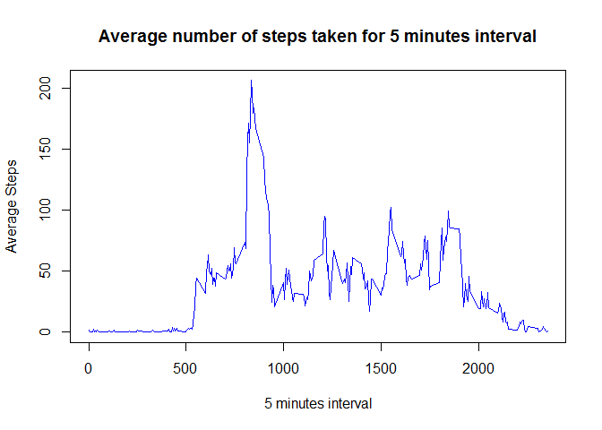

# Reproducible Research: Peer Assessment 1


### Loading and preprocessing the data

1. Download the Activity monitoring dataset from course web site.

2. Unzip the file (activity.csv) to working directory. 

3. Set the working directory in RStudio.

```r
setwd("your working directory")
```

4. Load the CSV 

```r
rawData <- read.csv("activity.csv")
```

5. Remove the missing values (NA) from raw data and convert the date values as date

```r
cleanData <- na.omit(rawData)
cleanData$date <- as.Date(cleanData$date)
```
<br>


### What is mean total number of steps taken per day?

1. Calculate total number of steps taken each day

```r
totalSteps.eachday <- tapply(cleanData$steps, cleanData$date, sum )
```

2. Plot the histogram of the total number of steps taken each day

```r
hist(totalSteps.eachday, xlab = "Total Steps", main = "Total number of steps taken each day", col = "blue")
```

<!-- -->

3. Mean and median number of steps taken each day

```r
summary(totalSteps.eachday, digits = 5)
```

```
##    Min. 1st Qu.  Median    Mean 3rd Qu.    Max. 
##      41    8841   10765   10766   13294   21194
```
Mean number of steps is 10766 and 
Median number of steps is 10765
<br><br>


### What is the average daily activity pattern?

1. Make the time series plot of the 5-minute interval (x-axis) and the average number of steps taken, averaged across all days (y-axis)

```r
meanData <- with(cleanData, aggregate(steps, by=list(interval), FUN=mean))
names(meanData) <- c("interval","averagesteps")
with(meanData, plot(interval, averagesteps, type = "l", col = "blue", xlab = "5 minutes interval", ylab = "Average Steps", main = "Average number of steps taken for 5 minutes interval"))     
```

<!-- -->

2. Which 5-minute interval, on average across all the days in the dataset, contains the maximum number of steps

```r
summary(meanData)
```

```
##     interval       averagesteps    
##  Min.   :   0.0   Min.   :  0.000  
##  1st Qu.: 588.8   1st Qu.:  2.486  
##  Median :1177.5   Median : 34.113  
##  Mean   :1177.5   Mean   : 37.383  
##  3rd Qu.:1766.2   3rd Qu.: 52.835  
##  Max.   :2355.0   Max.   :206.170
```

```r
## interval with maximum number of steps
meanData[meanData$averagesteps>=max(meanData$averagesteps),1]
```

```
## [1] 835
```

The maximum number of steps is 206.17 . Hence 835th interval contains the maximum number of steps.
<br><br>


### Imputing missing values

1. Calculate and report the total number of missing values in the dataset (i.e. the total number of rows with NAs)

```r
summary(rawData)
```

```
##      steps                date          interval     
##  Min.   :  0.00   2012-10-01:  288   Min.   :   0.0  
##  1st Qu.:  0.00   2012-10-02:  288   1st Qu.: 588.8  
##  Median :  0.00   2012-10-03:  288   Median :1177.5  
##  Mean   : 37.38   2012-10-04:  288   Mean   :1177.5  
##  3rd Qu.: 12.00   2012-10-05:  288   3rd Qu.:1766.2  
##  Max.   :806.00   2012-10-06:  288   Max.   :2355.0  
##  NA's   :2304     (Other)   :15840
```

```r
sum(is.na(rawData))
```

```
## [1] 2304
```

2. Strategy to fill the missing values with mean of 5 minutes interval

a) merge the original dataset with mean dataset

```r
mergeData <- merge(rawData, meanData, by = "interval")
```

b) create a new dataset that is equal to the original dataset but with the missing data filled in.

```r
imputData <- transform(mergeData, steps = ifelse(is.na(steps), averagesteps, steps))
imputData <- subset(imputData, select=-averagesteps)
```

3. Make a histogram of the total number of steps taken each day and Calculate and report the mean and median total number of steps taken per day

a) Calculate total number of steps taken each day

```r
totalSteps.eachday <- tapply(imputData$steps, imputData$date, sum )
```

b) Plot the histogram of the total number of steps taken each day

```r
hist(totalSteps.eachday, xlab = "Total Steps", main = "Total number of steps taken each day", col = "red")
```

<!-- -->

c) Mean and median number of steps taken each day

```r
summary(totalSteps.eachday, digits = 5)
```

```
##    Min. 1st Qu.  Median    Mean 3rd Qu.    Max. 
##      41    9819   10766   10766   12811   21194
```
Mean number of steps is 10766 and 
Median number of steps is 10766

The mean is unchanged, however imputing the missing data with average steps slightly changed the median.
<br><br>


### Are there differences in activity patterns between weekdays and weekends?

1. Create a new factor variable in the dataset with two levels - "weekday" and "weekend" indicating whether a given date is a weekday or weekend day.

```r
imputData <- transform(imputData, day = ifelse(grepl("S(at|un)", weekdays(as.Date(date))), "weekend", "weekday"))
imputData_mean <- with(imputData, aggregate(steps, by=list(interval, day), FUN=mean))
names(imputData_mean) = c("interval","day","averagesteps")
```

2. Make a panel plot containing a time series plot (i.e. type = "l") of the 5-minute interval (x-axis) and the average number of steps taken, averaged across all weekday days or weekend days (y-axis)


```r
library(lattice)
xyplot(averagesteps ~ interval | day, data = imputData_mean, type = "l", col = "blue", xlab = "Interval", ylab = "Number of steps", main = "Activity patterns between weekdays and weekends", layout = c(1, 2))
```

<!-- -->


